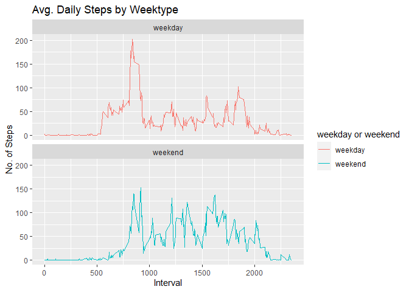

## Loading and preprocessing the data


```r
library(data.table)
library(ggplot2)

data <- data.table::fread(input = "data/activity.csv")
```

```r
head(data)
```

```
##    steps       date interval
## 1:    NA 2012-10-01        0
## 2:    NA 2012-10-01        5
## 3:    NA 2012-10-01       10
## 4:    NA 2012-10-01       15
## 5:    NA 2012-10-01       20
## 6:    NA 2012-10-01       25
```

## What is mean total number of steps taken per day?

```r
num_steps_per_day <- data[, c(lapply(.SD, sum, na.rm = FALSE)), .SDcols = c("steps"), by = .(date)] 

ggplot(num_steps_per_day, aes(x=steps)) + geom_histogram(binwidth = 1000) + labs(title = "Daily Steps", x = "Steps", y = "Frequency")
```

```
## Warning: Removed 8 rows containing non-finite values (stat_bin).
```

<!-- -->


```r
paste0("mean: ", mean(num_steps_per_day$steps, na.rm = TRUE))
```

```
## [1] "mean: 10766.1886792453"
```

```r
paste0("median: ", median(num_steps_per_day$steps, na.rm = TRUE))
```

```
## [1] "median: 10765"
```

## What is the average daily activity pattern?

```r
mean_daily_steps <- data[, c(lapply(.SD, mean, na.rm= TRUE)), .SDcols = c("steps"), by = .(interval)]

ggplot(mean_daily_steps, aes(x= interval, y = steps)) + geom_line(type = "1") + labs(title = "Average Daily Steps", x = "Interval", y= "Mean")
```

```
## Warning: Ignoring unknown parameters: type
```

<!-- -->

```r
mean_daily_steps[steps == max(steps), "interval"]
```

```
##    interval
## 1:      835
```

## Imputing missing values

Just fill with median

```r
filled_data <- data
filled_data[is.na(steps), "steps"] <- filled_data[, c(lapply(.SD, median, na.rm = TRUE)),  .SDcols = c("steps")]
filled_data[is.na(steps), .N]
```

```
## [1] 0
```


```r
total_steps_day <- filled_data[, c(lapply(.SD, sum)), .SDcols = c("steps"), by = .(date)]
```

## Are there differences in activity patterns between weekdays and weekends?


```r
filled_data[, date := as.POSIXct(date, format = "%Y-%m-%d")]
filled_data[, `Day of Week`:= weekdays(x = date)]
filled_data[grepl(pattern = "Monday|Tuesday|Wednesday|Thursday|Friday", x = `Day of Week`), "weekday or weekend"] <- "weekday"
filled_data[grepl(pattern = "Saturday|Sunday", x = `Day of Week`), "weekday or weekend"] <- "weekend"
filled_data[, `weekday or weekend` := as.factor(`weekday or weekend`)]
head(filled_data, 10)
```

```
##     steps       date interval Day of Week weekday or weekend
##  1:     0 2012-10-01        0      Monday            weekday
##  2:     0 2012-10-01        5      Monday            weekday
##  3:     0 2012-10-01       10      Monday            weekday
##  4:     0 2012-10-01       15      Monday            weekday
##  5:     0 2012-10-01       20      Monday            weekday
##  6:     0 2012-10-01       25      Monday            weekday
##  7:     0 2012-10-01       30      Monday            weekday
##  8:     0 2012-10-01       35      Monday            weekday
##  9:     0 2012-10-01       40      Monday            weekday
## 10:     0 2012-10-01       45      Monday            weekday
```


```r
filled_data[is.na(steps), "steps"] <- filled_data[, c(lapply(.SD, median, na.rm = TRUE)), .SDcols = c("steps")]
IntervalDT <- filled_data[, c(lapply(.SD, mean, na.rm = TRUE)), .SDcols = c("steps"), by = .(interval, `weekday or weekend`)] 

ggplot(IntervalDT , aes(x = interval , y = steps, color=`weekday or weekend`)) + geom_line() + labs(title = "Avg. Daily Steps by Weektype", x = "Interval", y = "No. of Steps") + facet_wrap(~`weekday or weekend` , ncol = 1, nrow=2)
```

<!-- -->
